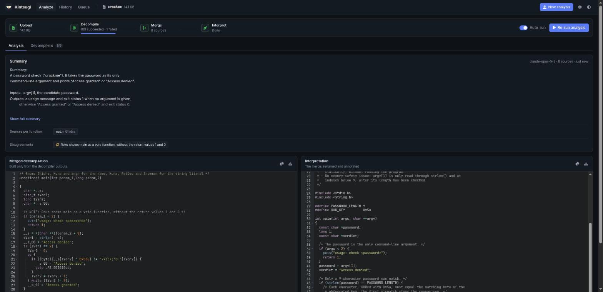
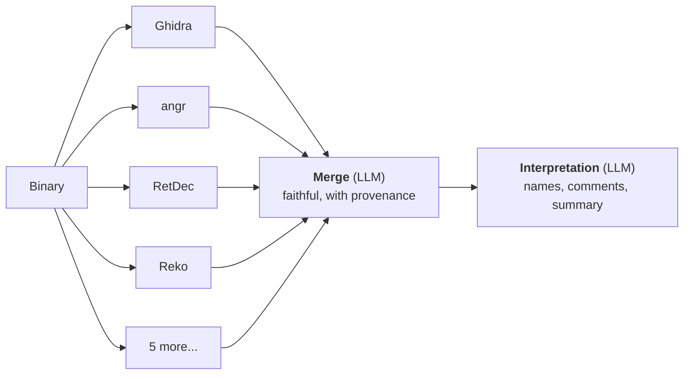

<p align="center">
  
</p>

<h1 align="center">Kintsugi</h1>

<p align="center">
  <b>Self-hosted multi-decompiler explorer with an LLM merge.</b><br>
  Run Ghidra, angr, RetDec, Reko, Snowman, rev.ng and more on the same binary,<br>
  merge their output into one faithful C listing, then get it renamed, commented and explained.
</p>

<p align="center">
  A fork of <a href="https://github.com/decompiler-explorer/decompiler-explorer">Decompiler Explorer</a>
  (<a href="https://dogbolt.org">dogbolt.org</a>) by Vector 35.
</p>

<p align="center">
  
  
  
  
</p>

<p align="center"></p>

---

Kintsugi is a fork of [Decompiler Explorer](https://github.com/decompiler-explorer/decompiler-explorer), the open-source project behind [dogbolt.org](https://dogbolt.org). It keeps what Decompiler Explorer does, running many decompilers on the binary you upload and showing their outputs side by side, and adds a step on top.

Every decompiler gets part of a binary right: one recovers the types, another the control flow, a third the string constants. Kintsugi uses an LLM to **join the parts each one gets right into a single listing, keeping the seams visible**: every merged function says which decompiler it comes from.

> *Kintsugi (金継ぎ) is the Japanese art of repairing broken pottery with gold, so that the cracks stay visible instead of hidden.*

## Why

Asking an LLM to "clean up" decompiled code mixes two things: merging what the decompilers show, and guessing what the programmer meant. Variables get renamed, idioms rewritten, a raw `int 0x80` becomes `exit(1)`, a missing bounds check is silently added. You can no longer tell what the binary does from what the model assumed.

Kintsugi keeps the two apart, in two separate LLM calls:

1. **Merge**: a single listing built *only* from the decompiler outputs. Their identifiers (`local_1c`, `uVar1`, `param_1`...) and constructs are kept, nothing is renamed or "simplified", and a `/* from: ... */` line above each function names its source. Disagreements between decompilers are flagged with `/* NOTE: ... */`.
2. **Interpretation**: that merge, and only that merge, gets meaningful names, comments, a summary and the memory-safety issues spotted. The behaviour must stay identical: no added checks, no invented values, no guessed syscalls, no bug "fixed". Bugs are pointed out in comments instead.



## Example

Abridged output on [`examples/crackme.c`](examples/crackme.c), compiled with `gcc -O2 -s`.

**Merge**: the decompilers' own names and expressions, with their sources:

```c
/* from: Ghidra, Kuna, Reko, RetDec */
int main(int argc, char **argv)
{
  char *__s;
  long lVar1;
  char *__s_00;

  if (argc < 2) {
    puts("usage: check <password>");
    return 1;
  }
  __s = argv[1];
  __s_00 = "Access denied";
  if (strlen(__s) == 9) {
    lVar1 = 0;
    do {
      if ((byte)(__s[lVar1] ^ 0x5aU) != "7<1:+;'0-"[lVar1]) {
        __s_00 = "Access denied";
        goto LAB_001010cd;
      }
      lVar1 = lVar1 + 1;
  /* ... */
```

**Interpretation**: the same code, explained:

```c
/*
 * Program Summary:
 * This is a simple password validation ("crackme") utility.
 * It expects a single command-line argument containing a 9-character password.
 *
 * Notable Behavior / Analysis:
 * - The program implements a basic XOR-based obfuscation. Each character of the
 *   input string is XORed with the constant byte 0x5A and compared against the
 *   hardcoded ciphertext "7<1:+;'0-".
 * ...
 */
```

## What this fork changes

Compared with [Decompiler Explorer](https://github.com/decompiler-explorer/decompiler-explorer), Kintsugi:

- **adds** the LLM merge and interpretation of the decompiler outputs, with Gemini, Claude or any OpenAI-compatible API, a key set on the server or in the browser, and analyses that run as server-side jobs and are saved;
- **adds** a history of the analysed binaries, and skips the decompilers that can't handle a binary instead of letting them fail;
- **redesigns** the web interface, and reports decompiler failures more clearly;
- **is meant to run locally**: a single `docker-compose.yml` with the license-free decompilers, instead of the Swarm / Traefik / S3 deployment of dogbolt.org (the commercial decompilers can still be added with your own licenses);
- **drops** the Dogbolt name and logo, the sample binaries and the FAQ page.

The full history of Decompiler Explorer is kept in this repository.


## Features

- **9 license-free decompilers** out of the box: angr, Boomerang, Ghidra, Kuna, RecStudio, Reko, RetDec, rev.ng and Snowman. Binary Ninja, Hex-Rays, dewolf and Relyze plug in with your own licenses.
- **Faithful merge with provenance**: click a function in the summary to jump to it, and see which decompiler it comes from.
- **Interpretation** with a summary of what the program does and the issues it has (unchecked indexes, overflows, anti-analysis...).
- **Any LLM**: Google Gemini, Anthropic Claude, or any OpenAI-compatible API (OpenAI, Mistral, OpenRouter, Groq, DeepSeek, a local Ollama or vLLM server). Use the server's key, or paste your own in the browser.
- **Runs in the background**: the analysis is a server-side job. Leave or reload the page and it keeps going, without starting again.
- **History** of every binary analysed, with its saved results.
- Side-by-side decompiler panes, re-run per decompiler, copy / download as `.c`, drag & drop, light and dark themes.
- A small JSON **API** to script it all.


## Quick start

You need Docker with the Compose plugin, and about 20 GB of disk for the decompiler images.

```shell
git clone https://github.com/fZpHr/Kintsugi.git
cd Kintsugi

# Optional: a server-side AI key (see the comments in the file)
cp .env.example .env

# One-time: generate ./secrets/* (skips the ones that already exist)
mkdir -p secrets && for s in db_superuser_pass worker_auth_token; do
  [ -f secrets/$s ] || openssl rand -hex 32 | tr -d '\n' > secrets/$s; done

docker compose up -d --build   # the first build takes a while
```

Open <http://localhost:8000>, drop an executable (ELF, PE or Mach-O; small ones work best, up to 2 MB), and add an API key under **Settings** (gear icon) if the server has none.

```shell
docker compose logs -f explorer   # web server logs, including the AI calls
docker compose down               # stop everything
```


## AI providers

Open **Settings** to choose the provider, paste an API key and optionally pick a model; **Test connection** checks them. The key is stored in your browser only, and sent to the server with each analysis request, which forwards it to the provider. Without one, the server's own key from `.env` is used.

| Provider | Server variables | Default model |
|---|---|---|
| Google Gemini | `GEMINI_API_KEY`, `GEMINI_MODEL`, `GEMINI_FALLBACK_MODELS` | `gemini-3.5-flash`, then fallbacks when a model is overloaded or out of quota |
| Anthropic Claude | `ANTHROPIC_API_KEY`, `ANTHROPIC_MODEL` | `claude-sonnet-5-5` |
| OpenAI-compatible | `OPENAI_API_KEY`, `OPENAI_BASE_URL`, `OPENAI_MODEL` | none: set the model, e.g. with `https://api.mistral.ai/v1` or `https://openrouter.ai/api/v1` |

An analysis costs two requests (merge, then interpretation). Mind the Gemini API free tier: at the time of writing it allows 20 requests per day on `gemini-3.5-flash`, and none on the Pro models.

Other settings (`AI_PROVIDER`, `AI_MAX_TOKENS`, `AI_MAX_INPUT_CHARS`...) are documented in [`.env.example`](.env.example).


## API

| Method | Endpoint | |
|---|---|---|
| `POST` | `/api/binaries/` | Upload a binary (multipart field `file`). Returns its `id`. |
| `GET` | `/api/binaries/<id>/decompilations/` | Decompiler results, as they arrive. |
| `POST` | `/api/binaries/<id>/decompilations/ai_analysis/` | Start the analysis (JSON body, all optional: `step: "interpret"` to redo only the interpretation, `provider`, `api_key`, `model`, `base_url`). |
| `GET` | `/api/binaries/<id>/decompilations/ai_analysis/` | Its `status` (`merging`, `interpreting`, `done`, `failed`) and results (`best`, `interpreted`). |
| `GET` | `/api/history` | Analysed binaries, newest first. |
| `DELETE` | `/api/history/<id>` | Delete a binary, its decompilations and its analysis. |
| `POST` | `/api/ai/test` | Check an AI provider config. |

```shell
id=$(curl -s -F file=@crackme http://localhost:8000/api/binaries/ | jq -r .id)
# ... wait for the decompilers, then:
curl -s -X POST -H 'Content-Type: application/json' -d '{}' \
     http://localhost:8000/api/binaries/$id/decompilations/ai_analysis/
curl -s http://localhost:8000/api/binaries/$id/decompilations/ai_analysis/ | jq -r .status
```


## Decompilers

They are not part of this repository: their Docker images download them at build time, each under its own license.

| Decompiler | License |
|---|---|
| [angr](https://angr.io) | BSD-2-Clause |
| [Boomerang](https://github.com/BoomerangDecompiler/boomerang) | BSD-style |
| [Ghidra](https://github.com/NationalSecurityAgency/ghidra) | Apache-2.0 |
| [Kuna](https://github.com/Noelo-Lab/kuna) | Apache-2.0 |
| [RecStudio](https://www.backerstreet.com/rec/rec.htm) | Freeware, closed source |
| [Reko](https://github.com/uxmal/reko) | GPL-2.0 |
| [RetDec](https://github.com/avast/retdec) | MIT |
| [rev.ng](https://github.com/revng/revng) | GPL-2.0 (individual files MIT) |
| [Snowman](https://github.com/mborgerson/snowman) | GPL-3.0 |

The commercial ones (Binary Ninja, Hex-Rays, dewolf, Relyze) need your own licenses, see [here](runners/decompiler/tools/README.md). If you publish the built images, you redistribute these tools and must comply with their licenses (the GPL ones require offering their source). Never publish an image that includes a commercial decompiler, nor run a public instance with one: dogbolt.org runs them under a specific agreement with their vendors, and their EULAs forbid it for anyone else.


## Limitations

- The LLM can still be wrong. The merge is built to be checked: compare a function with the decompiler its `/* from: ... */` line names.
- Decompilers known not to handle a binary's format, architecture or bitness are skipped rather than run (see [`explorer/compatibility.py`](explorer/compatibility.py)). Boomerang, for instance, only handles 32-bit binaries, and hangs on some of them: it then gives up after 60 s (`BOOMERANG_TIMEOUT`), and the merge goes without it.
- RecStudio runs without the default seccomp profile, which blocks the 32-bit socket calls of its embedded web server (see `docker-compose.yml`).
- Large binaries make slow decompilers and long prompts: the longest outputs are truncated to `AI_MAX_INPUT_CHARS`.


## Running a public instance

The defaults are meant for a local, single-user instance. If other people can reach yours, set in `.env`:

- `HISTORY_ENABLED=0`: otherwise every visitor sees, and can delete, every analysed binary;
- `AI_ALLOW_CUSTOM_BASE_URL=0`: otherwise the server sends requests to any URL a visitor enters as an OpenAI-compatible base URL;
- `AI_ALLOW_BROWSER_KEYS=0` if visitors should only use the server's key.


## Privacy

The decompiled code of every binary you analyse is sent to the AI provider you choose. On the Gemini API free tier, Google may use prompts and responses to improve its products, and human reviewers may read them. Don't analyse anything confidential with it: use a paid tier, or a local model through an OpenAI-compatible server.


## Development

```shell
pipenv install
pipenv run python manage.py migrate
pipenv run python manage.py runserver 0.0.0.0:8000   # the web app only, no decompilers
```


## Related projects

- [Decompiler Explorer / dogbolt.org](https://github.com/decompiler-explorer/decompiler-explorer), which Kintsugi is a fork of: the same side-by-side comparison, including commercial decompilers on dogbolt.org, without the merge.
- [mdec](https://github.com/mborgerson/mdec): decompilation as a service, comparing many decompilers.
- [LLM4Decompile](https://github.com/albertan017/LLM4Decompile): LLMs fine-tuned to decompile binaries, or to refine Ghidra's output.


## License and credits

Kintsugi is released under the MIT license, see [LICENSE.txt](LICENSE.txt). It is a fork of [Decompiler Explorer](https://github.com/decompiler-explorer/decompiler-explorer), Copyright (c) 2022 Vector 35 Inc, also under the MIT license, whose contributors made the decompiler comparison this project builds on. It is not affiliated with or endorsed by Vector 35, Hex-Rays or dogbolt.org.
